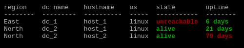

# Jtable



Jtable helps you render tables from key/value sources like JSON, YAML, and Python dictionaries.
It works as a CLI tool, a Jinja filter (usable in Ansible, Django, Flask, etc.), or a Python module.

---

## Features
- Render tables from JSON, YAML, or Python objects
- CLI usage, Jinja filter, or Python import
- Conditional coloring and formatting (see screenshot above)
- Advanced selection, filtering, and transformation with query files
- Output formats: plain, JSON, HTML, GitHub, LaTeX, etc.
- Multi-file loading and aggregation
- Integration with Ansible and other Python frameworks
- Inspect and explore nested data structures

---

## Quick Install
```bash
pip install jtable
```
Or clone and use locally:
```bash
git clone <repo_url>
cd jtable
pip install -r requirements.txt
```

---

## Basic Usage

```yaml
- hostname: host_1
  os: linux
  cost: 5000
  state: alive
  env: qua
- hostname: host_2
  os: linux
  cost: 5000
  state: alive
  env: qua
- hostname: host_3
  os: linux
  state: unreachable
  env: qua
```

```bash
cat host_dataset.yml | jtable
```

Output:
```text
hostname    os       cost  state        env
----------  -----  ------  -----------  -----
host_1      linux    5000  alive        qua
host_2      linux    5000  alive        qua
host_3      linux          unreachable  qua
```

---

## More Examples
- [Setup Guide](./doc/setup/README.md)
- [Advanced Examples](./doc/examples/README.md)

---

## Contributing
Pull requests and issues are welcome! For major changes, please open an issue first to discuss what you would like to change.

---

## License
See [LICENSE.txt](LICENSE.txt)

