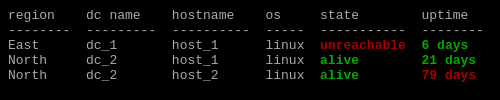

[[_TOC_]]
## Overview  
- jtable helps you to render table from key / lists / values sources like json, yaml, and Python objects.  
- It works as a cli in a shell and as a Jinja filter that may be integrated in a Python framework like Ansible, Django, Flask and others  
## Simple usage

  
#### json coming from curl

command: 
```bash
curl -s https://samples-files.com/samples/Code/json/sample3.json | jtable -p books
```
output:

```text
title                                  author               genre
-------------------------------------  -------------------  -----------
The Catcher in the Rye                 J.D. Salinger        Fiction
To Kill a Mockingbird                  Harper Lee           Classics
The Great Gatsby                       F. Scott Fitzgerald  Classics
Sapiens: A Brief History of Humankind  Yuval Noah Harari    Non-Fiction

```

```json
{
    "books": [
      {
        "title": "The Catcher in the Rye",
        "author": "J.D. Salinger",
        "genre": "Fiction"
      },
      {
        "title": "To Kill a Mockingbird",
        "author": "Harper Lee",
        "genre": "Classics"
      },
      {
        "title": "The Great Gatsby",
        "author": "F. Scott Fitzgerald",
        "genre": "Classics"
      },
      {
        "title": "Sapiens: A Brief History of Humankind",
        "author": "Yuval Noah Harari",
        "genre": "Non-Fiction"
      }
    ]
  }
  
```
### display a list of dictionnaries as a table
Considering the following dataset you want to display as a table  

```file: host_list_of_dict.yml```

```yaml
- hostname: host_1
  os: linux
  cost: 5000
  state: alive
  env: qua
- hostname: host_2
  os: linux
  cost: 5000
  state: alive
  env: qua
- hostname: host_3
  os: linux
  state: unreachable
  env: qua


```

command: 
```bash
cat host_list_of_dict.yml  | jtable
```
output:

```text
hostname    os       cost  state        env
----------  -----  ------  -----------  -----
host_1      linux    5000  alive        qua
host_2      linux    5000  alive        qua
host_3      linux          unreachable  qua

```
  
#### display dictionnaries of dictionnaries as a table

command: 
```bash
cat host_dict_of_dict.yml  | jtable
```
output:

```text
key     value.os      value.cost  value.state
------  ----------  ------------  -------------
host_1  linux               5000  alive
host_2  linux                200  alive
host_3  linux                     unreachable

```
## Use path  
This argument allow you accessing  your dataset when located under a key or a list  
example when datset under a key:  

```host_list_of_dict_in_key.yml```

```yaml
hosts:
  - hostname: host_1
    os: linux
    cost: 5000
    state: alive
    env: qua
  - hostname: host_2
    os: windows
    cost: 5000
    state: alive
    env: qua
  - hostname: host_3
    os: linux
    state: unreachable
    env: qua


```
  
#### access to key in path

command: 
```bash
cat host_list_of_dict_in_key.yml  | jtable -p hosts
```
output:

```text
hostname    os         cost  state        env
----------  -------  ------  -----------  -----
host_1      linux      5000  alive        qua
host_2      windows    5000  alive        qua
host_3      linux            unreachable  qua

```
### Inspect Option
Here is what would look to if the path is omitted:  


command: 
```bash
cat host_list_of_dict_in_key.yml | jtable
```
output:

```text
key    value.hostname    value.os    value.cost    value.state    value.env
-----  ----------------  ----------  ------------  -------------  -----------
hosts

```
It looks to nothing... :)  
Here is the way to inspect what is inside your dataset.  
All paths are covered until meeting a value, the path is display on the lef and the value on the right.

  
#### Inspect inputs command

command: 
```bash
cat host_list_of_dict_in_key.yml  | jtable --inspect
```
output:

```text
path               value
-----------------  -----------
hosts[0].hostname  host_1
hosts[0].os        linux
hosts[0].cost      5000
hosts[0].state     alive
hosts[0].env       qua
hosts[1].hostname  host_2
hosts[1].os        windows
hosts[1].cost      5000
hosts[1].state     alive
hosts[1].env       qua
hosts[2].hostname  host_3
hosts[2].os        linux
hosts[2].state     unreachable
hosts[2].env       qua

```

```yaml
region:
  East:
    "Data Center":
      dc_1:
        hosts:
          - hostname: host_1
            os: linux
            cost: 5000
            state: alive
            env: qua
          - hostname: host_2
            os: linux
            cost: 5000
            state: alive
            env: qua
          - hostname: host_3
            os: linux
            state: unreachable
            env: qua


```

command: 
```bash
cat key_containing_space.yml | jtable -p "region.East['Data Center'].dc_1.hosts"
```
output:

```
hostname    os       cost  state        env
----------  -----  ------  -----------  -----
host_1      linux    5000  alive        qua
host_2      linux    5000  alive        qua
host_3      linux          unreachable  qua

```
## Use query file
if you want to hide, show a given filter you have to build a query file
You can display the query and redirect it to a given file using the following option:
  
#### view_query option

command: 
```bash
cat key_containing_space.yml | jtable -p "region.East['Data Center'].dc_1.hosts" --view_query
```
output:

```yaml
queryset:
  path: region.East['Data Center'].dc_1.hosts{}
  select:
  - as: hostname
    expr: hostname
  - as: os
    expr: os
  - as: cost
    expr: cost
  - as: state
    expr: state
  - as: env
    expr: env
out: '{{ stdin | jtable(queryset=queryset) }}'


```
### Query file sample:

```yaml
hosts:
  - hostname: host_1
    os: linux
    cost: 5000
    state: alive
    env: qua
  - hostname: host_2
    os: windows
    cost: 5000
    state: alive
    env: qua
  - hostname: host_3
    os: linux
    state: unreachable
    env: qua


```

command: 
```bash
cat host_list_of_dict_in_key.yml | jtable -p hosts -q select_host_basic.yml
```
output:

```
host    os type
------  ---------
host_1  linux
host_2  windows
host_3  linux

```
## Transform table content using Jinja  
Your data may not arrived exatcly how you want to represent them.  
In fact they never arrived as you want.  
The following example transform the uptime coming in seconds to days

  
#### Transform uptime coming in seconds to days

```yaml
hosts:
  - hostname: host_1
    os: linux
    uptime: 1879723
    state: alive
    env: qua
    dc: dc_1
  - hostname: host_2
    uptime: 6879723
    state: alive
    env: qua
    dc: dc_2
  - hostname: host_3
    uptime: 23455
    os: linux
    state: unreachable
    env: qua
    dc: dc_3


```

```yaml
select:
  - as: host
    expr: hostname
  - as: os type
    expr: os
  - as: uptime in days
    expr: "(((uptime | int ) / (60 * 60 * 24)) | string).split('.')[0] | string + ' days'"
```

command: 
```bash
cat uptime_dataset.yml | jtable -p hosts -q uptime_view.yml
```
output:

```
hostname    os       uptime  state        env    dc
----------  -----  --------  -----------  -----  ----
host_1      linux   1879723  alive        qua    dc_1
host_2              6879723  alive        qua    dc_2
host_3      linux     23455  unreachable  qua    dc_3

```
## Use variables in your query file
this will helps to make mapping table, or behalf like view

  
#### Use variables mapping table or view

```yaml

queryset:
  path: hosts{host}
  select:
    - as: region
      expr: dc_location[host.dc]
    - as: dc name
      expr: host.dc
    - as: hostname
      expr: host.hostname
    - as: os type
      expr: host.os
    - as: uptime in days
      expr: "(uptime_in_day | string ) + ' days' if uptime_in_day | int > 1 else (uptime_in_day | string ) +  ' day'"
    - as: sanity status
      expr: "'🔥 host.uptime exceed' if  uptime_in_day | int > 31 else '✅'"
  vars:
    dc_location:
      dc_1: East
      dc_2: North
    uptime_in_day: "((( host.uptime | int ) / (60 * 60 * 24)) | string).split('.')[0]"


out: "{{ stdin | jtable(queryset=queryset)}}"
```

command: 
```bash
cat uptime_dataset.yml | jtable -q uptime_view_with_vars.yml
```
output:

```
region    dc name    hostname    os type    uptime in days    sanity status
--------  ---------  ----------  ---------  ----------------  --------------------
East      dc_1       host_1      linux      21 days           ✅
North     dc_2       host_2                 79 days           🔥 host.uptime exceed
          dc_3       host_3      linux      0 day             ✅

```
## Name incoming attributes in namespace using **path** syntaxe ```stdin.hosts{item}```
This feature will help you for the suite describe after to add more context in your  
and avoid your variable coming from your input and the ones present.

  
#### Store data in a namespace using path syntaxe stdin.hosts{```item```}
```
cat uptime_dataset.yml | jtable -p "hosts{host}" -q name_incoming_attribute.yml
```


```yaml

queryset:
  select:
    - as: hostname
      expr: host.hostname
    - as: os
      expr: host.os
```
  
#### store parent key using path syntaxe "stdin.regions{region}.dc{dc_name}{host}"

```yaml
regions:
  west coast:
    dc:
      dc_a: 
        - { hostname: host_a_1, os: linux, state: alive }
        - { hostname: host_a_2, os: linux, state: "unreachable" }
        - { hostname: host_a_3, os: linux, state: alive }
      dc_b: 
        - { hostname: host_b_1, os: linux, state: alive }
        - { hostname: host_b_2, os: linux, state: alive }
        - { hostname: host_b_3, os: linux, state: alive }
  east:
    dc:
      dc_c:
        - { hostname: host_c_1, os: linux, state: alive }
        - { hostname: host_c_2, os: linux, state: alive }
        - { hostname: host_c_3, os: linux, state: alive }
  north:
    truc: coucou


```

command: 
```bash
cat region_dataset.yml | jtable -p "regions{region}.dc{dc}{host}" -q region_view.yml
```
output:

```
14:33:46 (line 365) | INFO ['truc']
14:33:46 (line 366) | ERROR .dc was not found in dataset level: 2
dc name    region      hostname    os     state
---------  ----------  ----------  -----  -----------
dc_a       west coast  host_a_1    linux  alive
dc_a       west coast  host_a_2    linux  unreachable
dc_a       west coast  host_a_3    linux  alive
dc_b       west coast  host_b_1    linux  alive
dc_b       west coast  host_b_2    linux  alive
dc_b       west coast  host_b_3    linux  alive
dc_c       east        host_c_1    linux  alive
dc_c       east        host_c_2    linux  alive
dc_c       east        host_c_3    linux  alive

```

```yaml
queryset:
  select:
  - as: dc name
    expr: dc.key
  - as: region
    expr: region.key
  - as: hostname
    expr: host.hostname
  - as: os
    expr: host.os
  - as: state
    expr: host.state
```
## Use jtable with Ansible
The plabybook

```yaml
- hosts: localhost
  gather_facts: no
  vars:
    host_list:
      - { hostname: host_1, os: linux, cost: 5000, state: alive,service: {name: "service1\nservice_3"}  }
      - { hostname: host_2, os: linux1, cost: 200, state: alive }
      - { hostname: host_3, os: windows, cost: 200, state: alive }
      - { hostname: host_4, os: windows, cost: 5000, state: decom, ips: ['192.168.1.1','192.168.1.2'] }
      - { hostname: host_5, os: windows, cost: 5000, state: decom, ips: [] }
  tasks:
      
  # - debug:
  #     msg: "{{ ansible_python_interpreter  }}"

  - debug:
      msg: "{{ host_list | jtable }}"


```
## Load multiple files
Considering the files below returned by ```ls -1 data/*/*/config.yml```

```
data/dev/it_services/config.yml
data/dev/pay/config.yml
data/prod/it_services/config.yml
data/prod/pay/config.yml
data/qua/pay/config.yml

```
cat data/dev/it_services/config.yml

```


- { hostname: host_dev_its_1, os: linux, cost: 5000 }
- { hostname: host_dev_its_2, os: linux, cost: 200  }
dirty line
- { hostname: host_dev_its_3, os: win, cost: 200  }

```

command: 
```bash
jtable -jfs "{input}:data/*/*/config.yml" -p {file}.content -q load_multi_json_queryset.yml
```
output:

```bash
14:33:46 (line 225) | WARNING fail loading file data/dev/it_services/config.yml, skipping
env    dept         hostname          os       cost
-----  -----------  ----------------  -----  ------
dev    pay          host_dev_pay_1    linux    5000
dev    pay          host_dev_pay_2    linux     200
dev    pay          host_dev_pay_3    win       200
prod   it_services  host_dev_its_1    linux    5000
prod   it_services  host_dev_its_2    linux     200
prod   it_services  host_dev_its_3    win       200
prod   pay          host_prd_pay_22   linux    5000
prod   pay          host_prd_pay_44   linux     200
prod   pay          host_prd_pay_33   win       200
qua    pay          host_qua_pay_22   linux    5000
qua    pay          host_qua_pay_444  linux     200
qua    pay          host_qua_pay_3R3  win       200

```

```yaml

queryset:
  select:
    - as: env
      expr: file.path.split('/')[1]
    - as: dept
      expr: file.path.split('/')[2]
    - as: hostname
      expr: hostname
    - as: os
      expr: os
    - as: cost
      expr: cost
```
# Embded filters
  
#### strf_time

```yaml
context:
  host_list:
    - { hostname: host_1, os: linux, cost: 5000, state: alive, env: '{ "env": "qua" }', order_date: "2016-08-14 20:00:12"  }
    - { hostname: host_2, os: linux, cost: 200, env: '{ "env": "test" }', order_date: "2016-08-14 20:00:12"}
    - { hostname: host_3, os: linux, cost: 200, state: alive, env: '{ "env": "dev" }'  , order_date: "2017-02-13 20:00:12"}
    - { hostname: host_3, os: linux, cost: 200, state: alive, env: '{ "env": "qua" }'  , order_date: "2018-09-14 14:00:12"}


queryset:
  path: "{}"
  select:
    - as: hostname
      expr: hostname
    - as: os
      expr: os
    - as: cost
      expr: cost 
    - as: state
      expr: state
    - as: order_date
      expr: '(("2016-08-14 20:00:12" | to_datetime) - ("2015-12-25" | to_datetime("%Y-%m-%d"))).total_seconds()'
    - as: strftime 
      expr: "  (order_date|to_datetime).strftime('%S') "

out: "{{ host_list | jtable(queryset=queryset) }}"
```

command: 
```bash
jtable -q strf_time_example.yml
```
output:

```
hostname    os       cost  state      order_date    strftime
----------  -----  ------  -------  ------------  ----------
host_1      linux    5000  alive     2.02032e+07          12
host_2      linux     200            2.02032e+07          12
host_3      linux     200  alive     2.02032e+07          12
host_3      linux     200  alive     2.02032e+07          12

```
# Conditional styling
  
#### Styling option

command: 
```bash
jtable -q uptime_view_colored.yml
```
output:

```bash
region    dc name    hostname    os     state        uptime
--------  ---------  ----------  -----  -----------  --------
East      dc_1       host_1      linux  unreachable  6 days
North     dc_2       host_1      linux  alive        21 days
North     dc_2       host_2      linux  alive        79 days

```
  
#### Ansible again

command: 
```bash
export export ANSIBLE_CONFIG="$PWD/ansible.cfg" && \
export ANSIBLE_FILTER_PLUGINS=./ansible_filter && \
export ANSIBLE_ACTION_WARNINGS=False && \
export ANSIBLE_STDOUT_CALLBACK=yaml && \
ansible-playbook ansible_playbook_example.yml

```
output:

```bash

PLAY [localhost] ***************************************************************

TASK [debug] *******************************************************************
ok: [localhost] => 
  msg: |-
    hostname    os         cost  state    service.name    ips
    ----------  -------  ------  -------  --------------  ------------------------------
    host_1      linux      5000  alive    service1
                                          service_3
    host_2      linux1      200  alive
    host_3      windows     200  alive
    host_4      windows    5000  decom                    ['192.168.1.1', '192.168.1.2']
    host_5      windows    5000  decom                    []

PLAY RECAP *********************************************************************
localhost                  : ok=1    changed=0    unreachable=0    failed=0    skipped=0    rescued=0    ignored=0   


```

