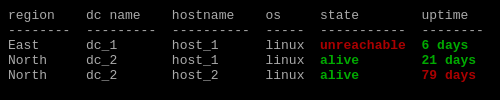

[[_TOC_]]

## Overview
- Jtable helps you render tables from key/list/value sources like JSON, YAML, and Python objects.
- Usable as a CLI tool, Jinja filter, or Python module (integrates with Ansible, Django, Flask, etc.)

---

## Features
- Render tables from JSON, YAML, or Python objects
- CLI, Jinja filter, or Python import
- Conditional coloring and formatting
- Advanced selection, filtering, and transformation with query files
- Output formats: plain, JSON, HTML, GitHub, LaTeX, etc.
- Multi-file loading and aggregation
- Integration with Ansible and other Python frameworks
- Inspect and explore nested data structures

---

## Screenshot: Conditional Styling



---

## CLI Commands and Options

### Commands
- `load_json <file>` : Load a single JSON file (or from stdin)
- `load_yaml <file>` : Load a single YAML file (or from stdin)
- `load_json_files <patterns...>` : Load multiple JSON files using glob patterns
- `load_yaml_files <patterns...>` : Load multiple YAML files using glob patterns

### Options
- `-p, --json_path` : Specify a path in the input data
- `-s, --select` : Select columns/fields to display
- `-us, --unselect` : Exclude columns/fields
- `-w, --when` : Filter rows by condition (e.g. `state == 'alive'`)
- `-f, --format` : Output format (simple, json, th, td, html, github, etc.)
- `-q, --query_file` : Load a query file (YAML)
- `--inspect` : Inspect and display all paths/values in the input
- `-vq, --view_query` : Show the generated query
- `-o, --stdout` : Override output filter
- `-pf, --post_filter` : Apply an additional filter to the output
- `--version` : Show version
- `-v, --verbose` : Verbosity level
- `-d, --debug` : Debug mode
- `-h, --help` : Show help

---

## Simple Usage

### display a list of dictionnaries as a table
Considering the following dataset you want to display as a table  

```file: host_list_of_dict.yml```

```yaml
- hostname: host_1
  os: linux
  cost: 5000
  state: alive
  env: qua
- hostname: host_2
  os: linux
  cost: 5000
  state: alive
  env: qua
- hostname: host_3
  os: linux
  state: unreachable
  env: qua


```

command: 
```bash
cat host_list_of_dict.yml  | jtable-filter from_yaml to_table
```
output:

```
text💥 Something was wrong with this report
 cmd was  ->  cat host_list_of_dict.yml  | jtable-filter from_yaml to_table
```
